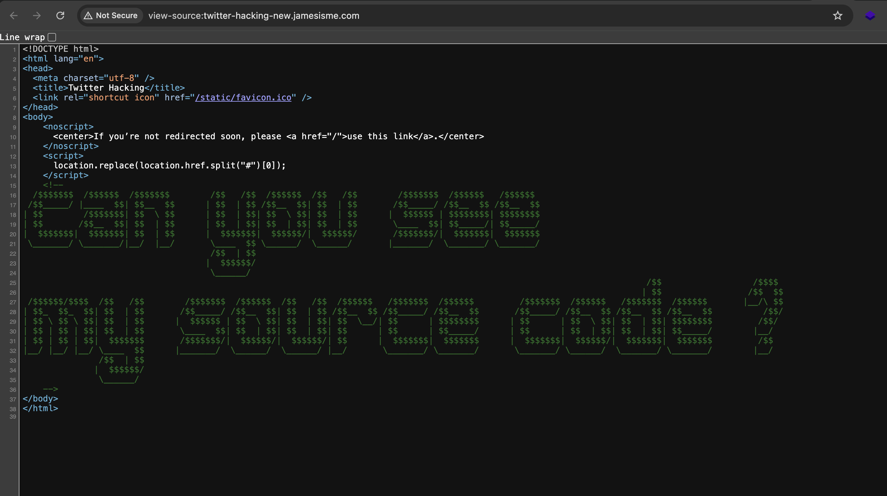

# twitter-hacking

> This project try to know how Twitter prevent user from viewing its source by using \"View Page Source\" on browser

[](./demo.mov)

# How to setup

## Docker

Start project by:

```
docker compose up -d
```

The app will be accessible at `http://localhost:3000`

## Without Docker

> [!NOTE]  
> NodeJS is required

First install dependencies:

```
npm install
```

Then start the project

```
npm start
```

# Demo

- Online demo: https://twitter-hacking.jamesisme.com

# Older version

The first version is configured using Nginx, the config looks complicated but may give you some idea how to make it works with Nginx. Check `nginx.default.conf`
